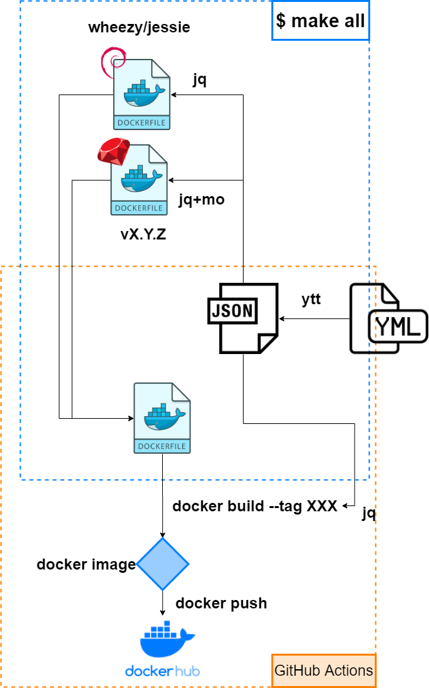

= 古めのOS/古めのRuby

image:https://github.com/sunakan/ruby-docker/workflows/v1.9/badge.svg[link=https://github.com/sunakan/ruby-docker/actions?query=workflow%3Av1.9]
image:https://github.com/sunakan/ruby-docker/workflows/v2.1/badge.svg[link=https://github.com/sunakan/ruby-docker/actions?query=workflow%3Av2.1]
image:https://github.com/sunakan/ruby-docker/workflows/v2.3/badge.svg[link=https://github.com/sunakan/ruby-docker/actions?query=workflow%3Av2.3]
image:https://github.com/sunakan/ruby-docker/workflows/v2.4/badge.svg[link=https://github.com/sunakan/ruby-docker/actions?query=workflow%3Av2.4]

image:https://dockeri.co/image/sunakan/ruby[link=https://hub.docker.com/repository/docker/sunakan/ruby]

.ex
----
$ docker pull sunakan/ruby:2.1.1-jessie-slim
----

DockerImageのサイズ
[cols="1,1"]
|===

|image:https://img.shields.io/docker/image-size/sunakan/ruby/2.4.1-wheezy-slim?label=2.4.1-wheezy-slim[]
|image:https://img.shields.io/docker/image-size/sunakan/ruby/2.4.1-jessie-slim?label=2.4.1-jessie-slim[]

|image:https://img.shields.io/docker/image-size/sunakan/ruby/2.3.2-wheezy-slim?label=2.3.2-wheezy-slim[]
|image:https://img.shields.io/docker/image-size/sunakan/ruby/2.3.2-jessie-slim?label=2.3.2-jessie-slim[]

|image:https://img.shields.io/docker/image-size/sunakan/ruby/2.1.3-wheezy-slim?label=2.1.3-wheezy-slim[]
|image:https://img.shields.io/docker/image-size/sunakan/ruby/2.1.3-jessie-slim?label=2.1.3-jessie-slim[]

|image:https://img.shields.io/docker/image-size/sunakan/ruby/2.1.1-wheezy-slim?label=2.1.1-wheezy-slim[]
|image:https://img.shields.io/docker/image-size/sunakan/ruby/2.1.1-jessie-slim?label=2.1.1-jessie-slim[]

|image:https://img.shields.io/docker/image-size/sunakan/ruby/1.9.3-wheezy-slim?label=1.9.3-wheezy-slim[]
|image:https://img.shields.io/docker/image-size/sunakan/ruby/1.9.3-jessie-slim?label=1.9.3-jessie-slim[]
|===

= 開発

== 流れ

== Dockerfileの位置

include::./docs/dockerfiles-layout.adoc[]

== セットアップと片付け

include::./docs/setup.adoc[]

== 実行

include::./docs/run.adoc[]

== yttの補足(YAMLファイル作るとき便利!!)

include::./docs/ytt-supplement.adoc[]

== moの補足(ロジックレスの超シンプルなテンプレートエンジンmustache)

include::./docs/mo-supplement.adoc[]

== Help

include::./docs/help.adoc[]
