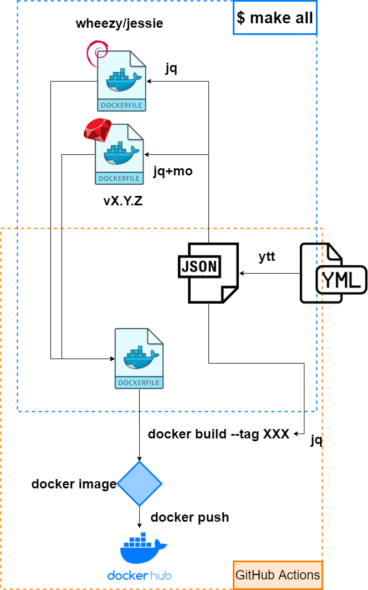

= 開発

== 流れ

== Dockerfileの位置

include::./dockerfiles-layout.adoc[]

== セットアップと片付け

include::./setup.adoc[]

== 実行

include::./run.adoc[]

== yttの補足(YAMLファイル作るとき便利!!)

include::./ytt-supplement.adoc[]

== moの補足(ロジックレスの超シンプルなテンプレートエンジンmustache)

include::./mo-supplement.adoc[]

== Help

include::./help.adoc[]
